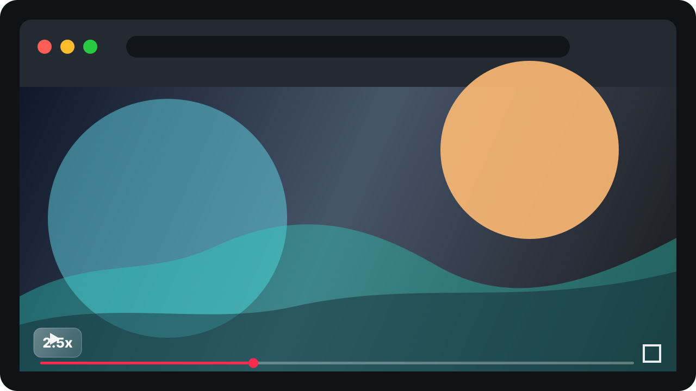

# Video Flow Keys

Video Flow Keys is a tiny Safari Web Extension for fast video playback control.
It was built end to end with Codex after I missed the old Dynamo Safari workflow.



## Shortcuts

| Key | Action |
| --- | --- |
| `S` | Slow the active video by the configured step. |
| `D` | Reset the active video to `1x`. |
| `F` | Speed the active video up by the configured step. |
| `E` | Bypass the current YouTube ad. |

On YouTube, videos start at `2x` by default. The popup lets you change the
start speed, step size, YouTube auto-start behavior, ad bypass behavior, and the
speed HUD.

## Install

Download the latest `Video-Flow-Keys.app.zip` from
[Releases](https://github.com/tristdrum/video-flow-keys/releases), unzip it, and
move `Video Flow Keys.app` to `/Applications`.

This first release is unsigned. Safari therefore needs unsigned extensions
enabled before the extension appears:

1. Open `/Applications/Video Flow Keys.app`.
2. Open Safari Settings.
3. In the Developer pane, enable **Allow unsigned extensions**.
4. In the Extensions pane, enable **Video Flow Keys**.
5. Grant website access when Safari asks.

See [docs/INSTALL.md](docs/INSTALL.md) for the longer version.

## Build From Source

Requirements:

- macOS with Safari
- Xcode
- Node.js 20 or newer

```sh
npm run check
npm test
npm run sync:macos
npm run build:macos
```

The Xcode project lives in `macos/Video Flow Keys/`.

## Privacy

Video Flow Keys stores settings locally through Safari extension storage. It has
no analytics, no tracking pixels, and no external network calls. The extension
requests broad website access because it works on generic `<video>` elements,
not because it sends browsing data anywhere.

Read the full privacy note in [docs/PRIVACY.md](docs/PRIVACY.md).

## Codex Build Archive

This project was vibe-coded with Codex from idea to working Safari extension:
research, implementation, testing, install, live Safari verification, and repo
prep. The public archive is sanitized so personal tabs, local machine details,
account context, and secrets stay private.

Read it in [docs/CODEX_BUILD_JOURNAL.md](docs/CODEX_BUILD_JOURNAL.md).

## Status

`v0.1.0` is a local-first release for Safari on macOS.
